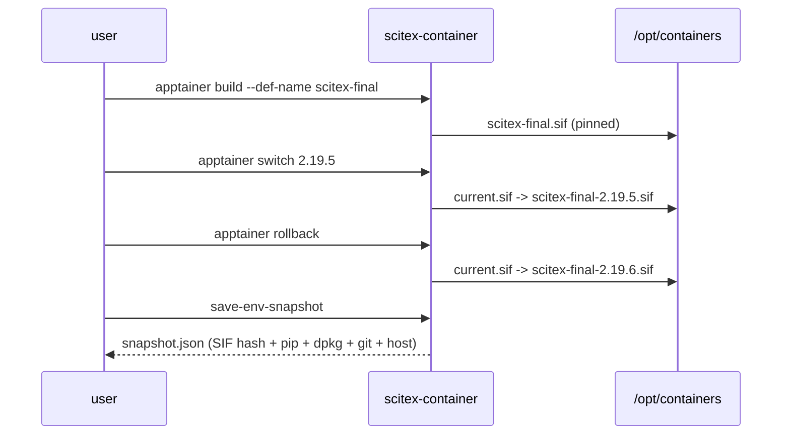

# SciTeX Container

<p align="center">
  <a href="https://scitex.ai">
    
  </a>
</p>

<p align="center"><b>Unified container management for Apptainer/Singularity and Docker — versioned SIFs, atomic switch/rollback, and reproducible env snapshots.</b></p>

<p align="center">
  <a href="https://scitex-container.readthedocs.io/">Full Documentation</a> · <code>uv pip install scitex-container[all]</code>
</p>

<!-- scitex-badges:start -->
<p align="center">
  <a href="https://pypi.org/project/scitex-container/"></a>
  <a href="https://pypi.org/project/scitex-container/"></a>
  <a href="https://github.com/ywatanabe1989/scitex-container/actions/workflows/rtd-sphinx-build-on-ubuntu-latest.yml"></a>
</p>
<p align="center">
  <a href="https://github.com/ywatanabe1989/scitex-container/actions/workflows/pytest-matrix-on-ubuntu-py3-11-3-12-3-13.yml"></a>
  <a href="https://github.com/ywatanabe1989/scitex-container/actions/workflows/import-smoke-on-ubuntu-py3-12.yml"></a>
  <a href="https://github.com/ywatanabe1989/scitex-container/actions/workflows/newb-docs-quality-on-ubuntu-latest.yml"></a>
  <a href="https://codecov.io/gh/ywatanabe1989/scitex-container"></a>
</p>
<!-- scitex-badges:end -->

---

## Problem and Solution

| # | Problem | Solution |
|---|---------|----------|
| 1 | **"Reproducible" containers drift** -- `Dockerfile` builds a different image each time because `apt-get install python3` floats | **Versioned SIF** -- `scitex-container build` pins the image content hash; `switch-version 2.19.5` is an atomic symlink flip |
| 2 | **Rollback requires docker tags + manual surgery** -- something breaks in prod; reverting to yesterday's container is 15 minutes of yak-shaving | **`rollback` is one command** -- previous active SIF restored; sandbox state preserved |
| 3 | **Paper "env" is `pip freeze`** -- useless without the python version, OS libs, CUDA driver | **`env_snapshot()`** -- full reproducibility capsule: container tag + pip freeze + conda env + apt packages + git commits, serialized as a single file for manuscript attachments |

## Architecture

```
scitex-container/
├── src/scitex_container/
│   ├── __init__.py              # apptainer, docker, host, env_snapshot + MCP-parity re-exports
│   ├── apptainer/
│   │   ├── _build.py            # build SIF / sandbox from .def (pinned hash)
│   │   ├── _config.py           # reproducible-build config (retain, require_verified)
│   │   ├── _freeze.py           # extract pip/dpkg/npm lock files from built SIF
│   │   ├── _lockgen.py          # lock capture, locked-def generation, version-set comparison
│   │   ├── _reproducible.py     # self-verifying reproducible-build round-trip + use-time verify gate
│   │   ├── _store.py            # timestamped (sif, lock) artifact store
│   │   ├── _versioning.py       # list / switch / rollback / deploy SIF versions
│   │   ├── _sandbox.py          # sandbox create / maintain / update / to-sif
│   │   ├── _sandbox_versioning.py # sandbox list / switch / rollback / cleanup
│   │   ├── _status.py           # list available containers and build status
│   │   ├── _utils.py            # shared utilities (detect container cmd, find containers dir)
│   │   └── _verify.py           # SIF + lock-file integrity
│   ├── docker/                  # rebuild / restart compose services
│   │   ├── _compose.py          # compose helpers
│   │   └── _mounts.py           # bind mount helpers
│   ├── host/                    # TeX Live, ImageMagick, bind mounts
│   │   ├── _mounts.py           # mount configuration
│   │   └── _packages.py         # install / check host packages
│   ├── _snapshot.py             # env_snapshot(): container + host + git + lock files
│   ├── _mcp/                    # MCP handler implementations
│   │   └── handlers.py          # async handlers: build, list, switch, rollback, deploy, etc.
│   ├── _cli/                    # scitex-container CLI entrypoint
│   │   ├── __init__.py          # main click group with all subcommands
│   │   ├── _apptainer.py        # apptainer sub-commands (build, freeze, list, switch, etc.)
│   │   ├── _docker.py           # docker sub-commands (rebuild, restart)
│   │   ├── _host.py             # host sub-commands (install, check, show-mounts)
│   │   ├── _sandbox.py          # sandbox sub-commands (create, maintain, list, switch, etc.)
│   │   ├── _status.py           # show-status dashboard
│   │   ├── _env_snapshot.py     # save-env-snapshot command
│   │   ├── _mcp.py              # mcp sub-commands (start, doctor, list-tools, install)
│   │   └── _skills.py           # skills list / get / install
│   ├── _compat.py               # compatibility shim for optional scitex-dev dependency
│   ├── mcp_server.py            # MCP server (optional, via fastmcp)
│   └── _skills/scitex-container/# bundled agent skill files
└── tests/
```

## Installation

Requires Python >= 3.10.

```bash
pip install scitex-container
```

With MCP server support (for AI agent integration):

```bash
pip install scitex-container[mcp]
```

Full installation:

```bash
pip install scitex-container[all]
```

## Quick Start

```bash
# Unified status dashboard
scitex-container show-status

# Build Apptainer SIF from definition file
scitex-container apptainer build scitex-final

# Version management
scitex-container apptainer list
scitex-container apptainer switch 2.19.5
scitex-container apptainer rollback

# Show all commands
scitex-container --help-recursive
```

## Four Interfaces

<details open>
<summary><strong>Python API</strong></summary>

<br>

```python
import scitex_container as ctr

# Apptainer container management
ctr.apptainer.build(def_name="scitex-final", sandbox=True)
ctr.apptainer.list_versions(containers_dir="/opt/containers")
ctr.apptainer.switch_version("2.19.5", containers_dir="/opt/containers")
ctr.apptainer.rollback(containers_dir="/opt/containers")

# Reproducible build round-trip (rough build + freeze + lock + verify)
result = ctr.apptainer.build_reproducible(
    layer="sac-base",
    root="/opt/containers",
    def_path="recipes/apptainer-base.def",
)
print(f"Verified: {result.verified}")

# Use-time verify gate
status = ctr.apptainer.check_verified("/opt/containers/sac-base.sif")
print(f"State: {status.state}")

# Host package management
ctr.host.check_packages()

# Docker operations
ctr.docker.rebuild(env="prod")
ctr.docker.restart(env="prod")

# Environment reproducibility snapshot
snapshot = ctr.env_snapshot()
```

<details>
<summary><strong>Reproducible Build API</strong></summary>

<br>

```python
from pathlib import Path
import scitex_container

# Verify container integrity
result = scitex_container.apptainer.verify(
    sif_path="/opt/containers/scitex-final.sif"
)
# Returns: {sif, def_origin, pip_lock, dpkg_lock, overall}

# Full reproducible round-trip
rt_result = scitex_container.apptainer.build_reproducible(
    layer="sac-base",
    root="/opt/containers",
    def_name="apptainer-base",
    verify=True,
    keep=False,
)
# rt_result.verified is True/None; rt_result.diff shows any drift

# Use-time gate
status = scitex_container.apptainer.check_verified(
    "/opt/containers/sac-base.sif",
    require_verified=True,
)
```

</details>

</details>

<details>
<summary><strong>CLI Commands</strong></summary>

<br>

```bash
scitex-container show-status              # Unified dashboard
scitex-container apptainer build           # Build SIF from .def
scitex-container apptainer freeze          # Extract pip/dpkg/npm lock files
scitex-container apptainer list            # List versioned SIFs
scitex-container apptainer switch VERSION  # Switch active SIF version
scitex-container apptainer rollback        # Revert to previous version
scitex-container apptainer deploy          # Copy active SIF to production
scitex-container apptainer clean           # Remove old versions
scitex-container apptainer verify          # Verify SIF integrity
scitex-container save-env-snapshot         # Reproducibility snapshot
```

<details>
<summary><strong>Sandbox Operations</strong></summary>

<br>

```bash
scitex-container sandbox create --source scitex-final.sif
scitex-container sandbox maintain -s scitex-sandbox/ -- apt-get update
scitex-container sandbox list -d ./containers
scitex-container sandbox switch 20260301_120000
scitex-container sandbox rollback
scitex-container sandbox clean --keep 3
scitex-container sandbox update -s scitex-sandbox/
```

</details>

<details>
<summary><strong>Host Package Management</strong></summary>

<br>

```bash
scitex-container host install          # Install TeX Live + ImageMagick
scitex-container host check            # Verify host packages
scitex-container host show-mounts      # Show configured bind mounts
```

</details>

<details>
<summary><strong>Docker Operations</strong></summary>

<br>

```bash
scitex-container docker rebuild        # Rebuild Compose services
scitex-container docker restart        # Restart services
```

</details>

</details>

<details>
<summary><strong>MCP Server</strong></summary>

<br>

scitex-container exposes an MCP server so AI agents (Claude, etc.) can manage containers autonomously.

```bash
# Start MCP server
scitex-container-mcp

# Diagnostics and tool listing
scitex-container mcp doctor
scitex-container mcp list-tools -vv
```

| Tool | Description |
|------|-------------|
| `container_build` | Build SIF or sandbox from .def file |
| `container_list_versions` | List versioned SIFs with active marker |
| `container_switch` | Switch active SIF version |
| `container_rollback` | Roll back to previous SIF version |
| `container_deploy` | Copy active SIF to production target dir |
| `container_cleanup` | Remove old SIF versions (keep N most recent) |
| `container_verify` | Verify SIF SHA256, .def origin, and lock files |
| `container_status` | Unified dashboard: Apptainer + host + Docker |
| `container_env_snapshot` | Capture environment snapshot |
| `container_skills_get` | Get content of a bundled skill file |
| `container_skills_list` | List bundled skill files |
| `sandbox_create` | Convert SIF to writable timestamped sandbox |
| `docker_rebuild` | Rebuild Docker images without cache |
| `docker_restart` | Restart Docker containers |
| `host_install` | Install TeXLive / ImageMagick on the host |
| `host_check` | Check which host packages are installed |

</details>

<details>
<summary><strong>Skills</strong></summary>

<br>

Skills provide workflow-oriented guides that AI agents query to discover capabilities and usage patterns.

```bash
scitex-container skills list              # List available skill pages
scitex-container skills get SKILL         # Show main skill page
scitex-dev skills export --package scitex-container  # Export to Claude Code
```

| Skill | Content |
|-------|---------|
| `01_installation` | pip install + runtime deps + smoke verify |
| `02_quick-start` | Build a SIF + snapshot environment |
| `03_python-api` | Top-level Python surface (re-exports + submodules) |
| `04_cli-reference` | Full `scitex-container` subcommand surface |
| `11_mcp-tools` | MCP tools for AI agents |
| `20_environment` | Environment variables |

</details>

## Demo



## Part of SciTeX

`scitex-container` is part of [**SciTeX**](https://scitex.ai). Install via
the umbrella with `pip install scitex[container]` to use as
`scitex.container` (Python) or `scitex container ...` (CLI).

```python
import scitex_container

# Capture snapshot for Clew integration
snapshot = scitex_container.env_snapshot()
# snapshot includes: container version, SIF hash, lock files, host packages
```

>Four Freedoms for Research
>
>0. The freedom to **run** your research anywhere — your machine, your terms.
>1. The freedom to **study** how every step works — from raw data to final manuscript.
>2. The freedom to **redistribute** your workflows, not just your papers.
>3. The freedom to **modify** any module and share improvements with the community.
>
>AGPL-3.0 — because we believe research infrastructure deserves the same freedoms as the software it runs on.

<p align="center">
  <a href="https://scitex.ai" target="_blank"></a>
</p>

<!-- EOF -->
